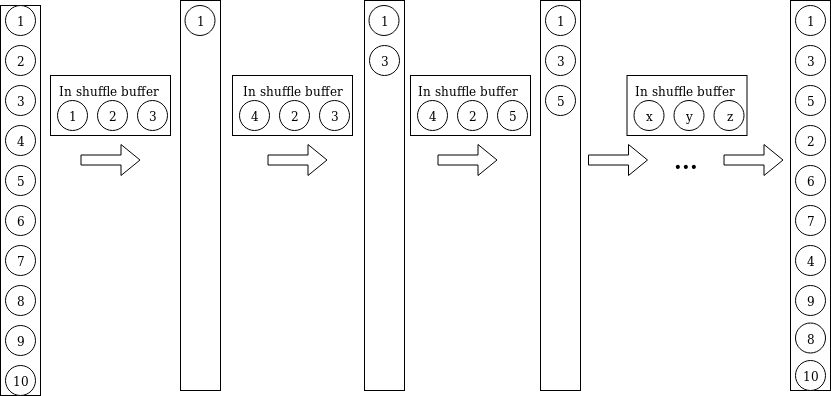
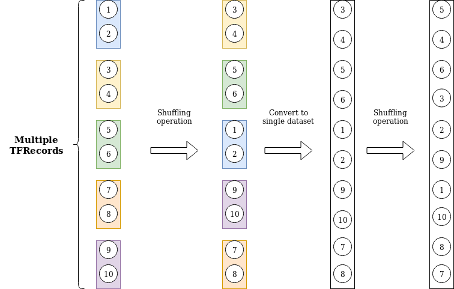
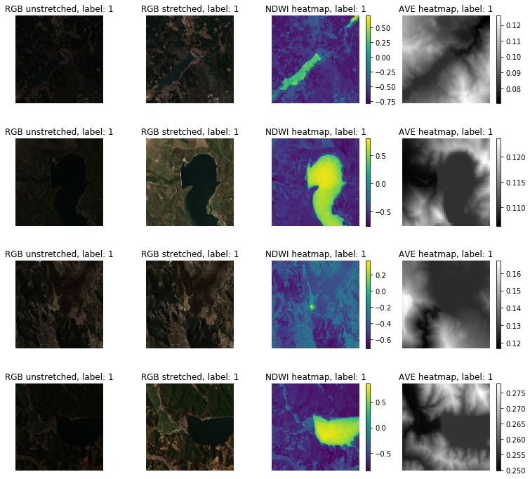

# Dam Detection using Neural Networks

Welcome to my blog on dam detection using neural networks. This projects primarily aims to detect dams using satellite data!

## Table of Contents
[Shuffle, shuffle, shuffle](#shuffle-shuffle-shuffle)   
[Working with TFRecords](#working-with-tfrecords)   
[Exploring Earth Engine](#exploring-earth-engine)   
1. [An update](#an-update)

*22 August 2019*
## Shuffle, Shuffle, Shuffle
Last time I covered a quick way to define a data transformation pipeline. At that moment I stil only had a single, large TFRecord that I had to parse. After reading some [discussion](https://datascience.stackexchange.com/questions/16318/what-is-the-benefit-of-splitting-tfrecord-file-into-shards/22767), I came to the conlusion that having a single 4GB TFRecord might not be the best option. For now I will explain why I think this is not best way to go, and how I solved it. 

First, it might be a good idea to explain how shuffling in TFRecords actually works [(Tensorflow docs)](https://www.tensorflow.org/api_docs/python/tf/data/Dataset): if your dataset contains 10,000 elements but buffer_size is set to 1,000, then shuffle will initially select a random element from only the first 1,000 elements in the buffer. Once an element is selected, its space in the buffer is replaced by the next (i.e. 1,001-st) element, maintaining the 1,000 element buffer.

This design was implemented so that data could be shuffled in memory, even with potentially huge datasets. In the end, the amount of memory necessary is tuned via the buffer size parameter. A consequence of the shuffle-queue design is that the shuffle function only allows for local randomness (inside of the queue, not across the entire record). As such, if the buffer size is not sufficiently large, then the sampled distribution will approximately have a relation with the original order. An illustration is shown below. The shuffle buffer is filled with elements in deterministic order. Then, an element is chosen at random and is processed further.



This is important to know, because backpropagation benefits from diversified samples. Ideally, you would feed a batch with a diverse set of classes. Furthermore, when you are passing the data a next time (a new epoch), you would want the data in a completely different order from the previous epoch, since this also helps with backpropagation.
In order to get a better sampling procedure, it might thus be a good idea to set a very high buffer size, but this has its limits because the buffer has to be filled, and is limited to the amount of available memory. As a compromise, it might be better to split up my one large TFRecord into multiple smaller ones. This is done in [TFRFilter.py](https://github.com/stephandooper/dam_detection/blob/master/scripts/TFRFilter.py), which also removes any corrupted records. The final implementation then consists of using a block shuffle strategy, along with the regular shuffle method, depicted below:




*15 August 2019*
## Working with TFRecords
TLDR: [Jupyter Notebook](https://github.com/stephandooper/dam_detection/blob/master/dam_detection.ipynb)   
After my last post, I was able to extract all of the images that I needed (GRanD dam locations, and some non-dam locations from [Charlotte Weil's blog post](https://medium.com/@charlotteweil/can-we-locate-dams-from-space-2a796ac8c04b), I was now finally ready to build a pipeline to parse the data and train some initial networks. The only problem was: the data was locked in TFRecords, and I had never worked with them before. This meant that I first had to read some tutorials on how to work with TFRecords. 

Basically, TFRecords work with a protocol buffer framework. Protocol buffers provide a mechanism to read and store data in an efficient way. What this means for us in practice is that we can work with potentially huge datasets, even if we do not have sufficient memory. After reading some tutorials I came up with a small list of the most important (dis)advantages

***Advantages***
1. The TFRecord data pipeline allows us to access huge amount of datasets, even if we do not have sufficient memory to load the entire dataset into, as explained above. All we need is enough persistent storage, and we are good to go.
2. We can make use of the ```Dataset``` API, along with Tensorflow eager execution. This has made things significantly easier from the old school sessions-based approach. The ```Dataset``` is an iterable object, which also has some very straightforward functions, of which the most important is ```Dataset.map()```, which basically maps a user-written function over several workers. Some other useful functions are ```batch, shuffle, interleave, list_files, prefetch, repeat```. It also supports user-defined lambda expressons. Another nice thing about the Dataset api is that we can just simply pass all of our TFRecords in a single go.
3. Parallelization & optimization: working with a TFRecord pipeline (and the Dataset API) allows us to parallelize and optimize the training procedure quite easily. Basically, the ```map``` function allows us to distribute the pre-processing across multiple workers (there is even a Spark application, which I do not use). Also, the CPU bottleneck has been addressed by creating an improved data pipeline that makes sure that the idle time of the CPU is minimzed, see [Tensorflow docs](https://www.tensorflow.org/guide/data_performance). All of this allows us to gain a huge boost in training speed, if used correctly. See for example [speeding up keras with tfrecord datasets](https://medium.com/@moritzkrger/speeding-up-keras-with-tfrecord-datasets-5464f9836c36), or [optimize tf input pipeline](https://sebastianwallkoetter.wordpress.com/2018/02/24/optimize-tf-input-pipeline/), which covers performance within a TFRecord pipeline

***Disadvantages***
1. The pipeline has a steep learning curve and takes some to implement. Since it is not as straightforward as loading a folder of images into memory, it takes a while to grasp the idea of why the TFRecord pipeline is useful, and how to use it properly. 
2. Since we are using a Tensorflow pipeline, we sadly do not have access to several packages which make life easier. Basically, we are stuck with whatever functionality Tensorflow offers, and cannot go outside it (without explicitly converting to numpy and suffering a major performance penalty). An example of this is the ```imgaug``` package, which provides a huge number of image augmentations, which you can define in a wide variety in a flexible way. As such, we will have to create our own image augmentation and augmentation routine (when to apply which augmentation, and in which frequency) using only Tensorflow.

#### Creating the pipeline
Surely, I was only able to make up this list after having played around with the TFRecord pipeline and trying to create one myself. Admittedly , this took longer than I expected. The framework is quite difficult to learn at first, especially since you have to write several lines of code before you can get some interpretable outputs, in this case being able to view the images. Since I do not want to bother anyone with a whole tutorial on how to parse TFRecords I will simply just refer to the [Jupyter Notebook](https://github.com/stephandooper/dam_detection/blob/master/dam_detection.ipynb) that I created.

While I was working my way through the entire process of finally being able to view the images that were locked away inside of the TFRecords, I noticed that they appeared to be very dark. The apparant reason for this was that the images color channels were in the range of [0, 0.3], whereas python expects either a range of [0,1] or [0,255]. A quick fix was to take the global maximum over the entire image (all 3 color channels) and divide each element in the channels by this number. The results was that the image itself is now in a range of [0,1], and looks a lot brighter, as shown below. 




Now that I am able to visualize the images inside the TFRecords, I thought it would be time to creat a small network. the Dataset API expects me to define a training routine beforehand. This means that I will have to list the operations I wish to perform on the TFRecords before passing it to the Tensorflow Keras API. An example of how this is done is shown below. Keep in mind that this is a code snipper from the notebook, and can be different later on, as I do not intend to update the code snippets inside of the blog as they could become too complicated.

```python
def create_dataset(file_names, target_size, buffer_size, channels, stretch_colorspace=True, augmentations=[]):
    files = tf.data.Dataset.list_files(file_names, shuffle=None, seed=SEED)
    
    dataset = tf.data.TFRecordDataset(files, compression_type='GZIP')
    dataset = dataset.shuffle(buffer_size=buffer_size)

    dataset = dataset.map(parse_serialized_example, num_parallel_calls=tf.data.experimental.AUTOTUNE)
    dataset = dataset.map(parse_image(dims = target_size, channels = channels, stretch_colorspace=stretch_colorspace), 
                          num_parallel_calls=tf.data.experimental.AUTOTUNE)
    dataset = dataset.batch(32)

    return dataset
```
What this code does is actually quite simple. First, we pass the location(s) of our TFRecords into the ```list_files``` function. At the time of writing, I only had a single (large) TFRecord, obtained from GEE. Then, a Dataset object is created from the ```tf.data.TFRecordDataset``` function. Now we can easily create a pipeline of operations that have to be performed before feeding the data into the model. We start by shuffling the records, since the TFRecords are parsed in a first in first out order, and are therefore deterministic. The ```shuffling``` loads the first ```buffer_size``` elements and randomly selects one of the elements to be processed first, thus randomizing the order. 

Then, we apply two map functions. The first one parses the TFRecords and converts them into a dictionary as key value pairs, which is then used in the second map function, where the images are parsed. Finally, we can create batches using the ```batch``` function, and we are now able to pass it to the keras model.


[Working with TFRecords](https://towardsdatascience.com/working-with-tfrecords-and-tf-train-example-36d111b3ff4d)

*1 August 2019*
## Exploring Earth Engine
 
Gathering data to work with has been sort of a challenge. Since I had no prior experience with javascript and Google's documentation on its Earth Engine API is rather minimal, I was mostly left with the tutorials and whatever I could find on the [gis stackexchange](https://gis.stackexchange.com). 

So the basic idea is that I found several datasets with manually annotated dam locations in shapefile format (WGS84) from the [Global Dam Watch](http://globaldamwatch.org/). The dataset I am using for now is called GRanD, which contains over 7000 locations of very large dams. The next logical step is to import this shapefile into Earth Engine. This was rather easy, as Google Earth Engine allows you to import external files as ```assets```, and import them as featurecollections in the code editor. Since I am completely new to GIS software the easiest thing to do is to visualize the dam locations, which looks like this:


Eyeballing the locations the coordinates seem to be in the right places, altough a little far off from the actual dam locations at times, but we'll just have to live with that. The next step is that I want to extract and download image patches around these coordinates so that I can feed them into a classifier for training. This turned out to be more difficult than I wanted, as the Earth Engine docs did not explicitly cover this. Luckily I found a blog post by [Charlotte Weil](https://medium.com/@charlotteweil/can-we-locate-dams-from-space-2a796ac8c04b) covering the same topic. In order to get to the result that we want we have take several steps, explained below.

The first step is to choose a satellite and the layers you want to use. For this project, I used the [Sentinel 2](https://developers.google.com/earth-engine/datasets/catalog/COPERNICUS_S2) Multispectral Instrument (MSI) with Level-1C orthorectified top-of-atmosphere reflectance. The most common problem with using satellite images is that they can be obstructed by clouds. Luckily GEE provides a code that removes most of the clouds right off the bat:

```javscript
function maskS2clouds(image) {
  var qa = image.select('QA60');

  // Bits 10 and 11 are clouds and cirrus, respectively.
  var cloudBitMask = 1 << 10;
  var cirrusBitMask = 1 << 11;

  // Both flags should be set to zero, indicating clear conditions.
  var mask = qa.bitwiseAnd(cloudBitMask).eq(0).and(
             qa.bitwiseAnd(cirrusBitMask).eq(0));

  return image.updateMask(mask).divide(10000).select('B.*').copyProperties(image, ["system:time_start"]);
}

// Map the function over one year of data and take the median.
var dataset = ee.ImageCollection('COPERNICUS/S2_SR')
                  .filterDate('2018-01-01', '2019-05-15')
                  // Pre-filter to get less cloudy granules.
                  .filter(ee.Filter.lt('CLOUDY_PIXEL_PERCENTAGE', 20))
                  .map(maskS2clouds);

var reduce_dataset = dataset.median();
var rgbVis = {min: 0.0,  max: 0.3,  bands: ['B2'],};

// display masking, and rgb
Map.addLayer(reduce_dataset.select('B2'), rgbVis, 'RGB');
```

The next step is to extract the bands (channels) we would like to use for training the classifier. The bands we choose are the RGB bands, which are encoded as B4, B3, and B2 in S2, and compute the Normalized Difference Water Index (NDWI), for which we also need the Near Infrared (NIR) band, which is named B8 in S2. All of the bands used from the S2 satellite are sampled at 10m resolution. Following the blog post from Charlotte, elevation is also factored in by using the Alos DSM. This brings up to a total of 5 bands (channels) to use for training. The code for selecting, calculating, and adding the RGB, NDWI, and elevation bands is given below.

```Javascript
// Calculate NDWI
var ndwi = reduce_dataset.normalizedDifference(['B3', 'B8']).rename('NDWI');
// use the imported ALOS DSM map and select the AVE band (average elevation)
var elevation = DSM.select(['AVE']).float();

// add bands, and sample in a neighborhood near the coordinates
var combinedImage = reduce_dataset.addBands(ndwi).addBands(elevation);
```
The next step is a crucial one and not in any of the official GEE tutorials. In order to extract pixels in a neighborhood around the GRanD dam coordinates, we can use the ```neighborhoodToArray``` function, which does exactly what we need: It turns the neighborhood of each pixel in a scalar image into a 2D array (see image below). Axes 0 and 1 of the output array correspond to Y and X axes of the image, respectively. The output image will have as many bands as the input; each output band has the same mask as the corresponding input band. The footprint and metadata of the input image are preserved.


The GEE implementation of this functionality looks like this:
```javascript
var sampleImage = combinedImage.neighborhoodToArray(ee.Kernel.rectangle(128,128, 'pixels')).select(['B2','B3','B4','NDWI','AVE']);
```
Note that we first have to define a shape (a rectangular kernel), so that the neighbohoodToArray function knows in which actual neighborhood to extract the pixels. A rectangle format of 128x128 pixels was chosen, which yields an image of 257x257.   

We are almost there, but we still need an extra step before we are able to export the image patches. Right now we have defined a sampleImage variable, but this is still an image feature with 5 bands. However, we do not want to export an image, but rather a more organized table, where each record contains an image patch from the GRanD locations. So what we want is a **featurecollection**, which has as many records as there are GRanD dam locations, and where each record holds the 5 bands as 2D arrays. This can be achieved using the ```sampleRegions``` function, which is outlined below:

```javascript
var dams_neighborhoods = sampleImage.sampleRegions({
            collection:grand,
            properties:['DAM_NAME'],
            scale:10,
            tileScale:4,
        }).map(function(feature) { return feature.set({class: 1}); });
```
This function takes the sampleImage we have defined above, and samples patches of 257x257 as defined in the neighborhoodToArray function, at the locations specified in the grand collection (so in a neighborhood of 128x128 around each grand dam location). Note that we also add a feature to each example in the featurecollection.

We now have a featurecollection with all of the desired data, that we can now export. This is by far the easiest part, and can be done as shown below

```javascript
Export.table.toDrive({
  collection: dams_neighborhoods,
  folder:'Dams',
  description: 'Grand_Dams',
  fileFormat: 'TFRecord',
  fileNamePrefix:'GrandDamSamples',
  selectors: ['label', 'B2', 'B3', 'B4','AVE','NDWI']
});
```

This all took quite a while to figure out, but it did pay off.

### An update 10/08/2019
Although sampleRegions is a convenient function, it does not allow for very large images to be sampled. As such, I was riddled with computation time out errors. Luckily, I was able to find a workaround. The key idea is that sampleRegions uses image.reduceRegions in its computations, which tries to do all of the computations in a single go. Since the amount of images that need to be extracted is large, it will never be done before the computation time limit is exceeded. To circumvent this problem, we can use image.reduceRegion instead, which computes only a single coordinate. We can simply put a map with the featurecollection as data input to compute all of the image patches. This way, the computation timer resets for each individual image. The only problem is that it might be slower than the sampleRegions function, which you can read about on [GEE](https://developers.google.com/earth-engine/debugging) 

```
// Sample grand dams
var damSamplesGrand = grand.map(function(feature) {
  // alternative to sampleRegion
  return feature.set(sampleImage.reduceRegion({
    reducer: 'first',
    scale:10,
    geometry: feature.geometry(),
    tileScale:4
  })).select(['B2', 'B3', 'B4', 'AVE', 'NDWI', 'DAM_NAME']);
}).map(function(feature){return feature.set({label:1})});
```


