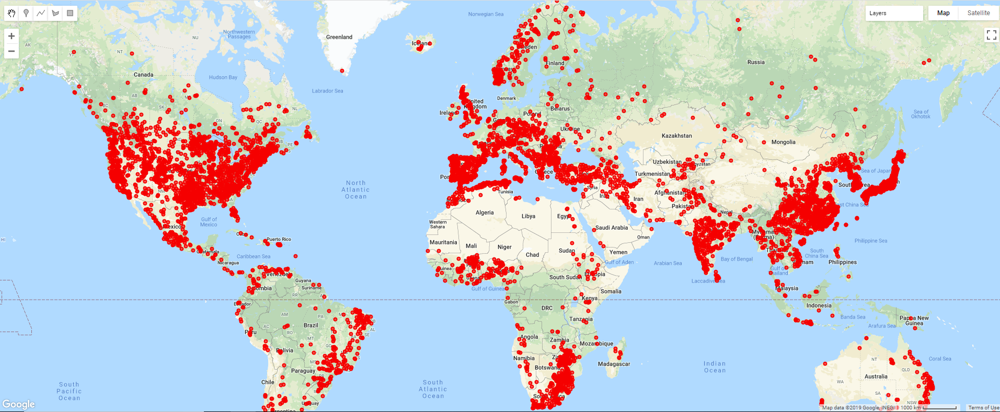
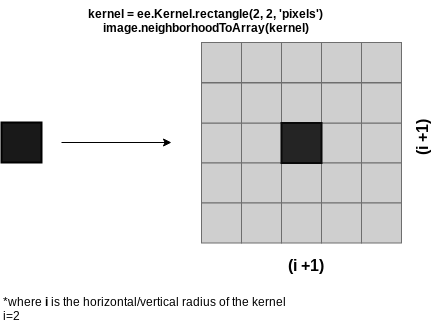

# Dam Detection using Neural Networks

Welcome to my blog on dam detection using neural networks. This projects primarily aims to detect dams using satellite data!

## Table of Contents
[Having fun with Earth Engine](#Working with Earth Engine)
[An update](###An update)


*1 August 2019*
## Exploring Earth Engine
 
Gathering data to work with has been sort of a challenge. Since I had no prior experience with javascript and Google's documentation on its Earth Engine API is rather minimal, I was mostly left with the tutorials and whatever I could find on the [gis stackexchange](https://gis.stackexchange.com). 

So the basic idea is that I found several datasets with manually annotated dam locations in shapefile format (WGS84) from the [Global Dam Watch](http://globaldamwatch.org/). The dataset I am using for now is called GRanD, which contains over 7000 locations of very large dams. The next logical step is to import this shapefile into Earth Engine. This was rather easy, as Google Earth Engine allows you to import external files as ```assets```, and import them as featurecollections in the code editor. Since I am completely new to GIS software the easiest thing to do is to visualize the dam locations, which looks like this:


Eyeballing the locations the coordinates seem to be in the right places, altough a little far off from the actual dam locations at times, but we'll just have to live with that. The next step is that I want to extract and download image patches around these coordinates so that I can feed them into a classifier for training. This turned out to be more difficult than I wanted, as the Earth Engine docs did not explicitly cover this. Luckily I found a blog post by [Charlotte Weil](https://medium.com/@charlotteweil/can-we-locate-dams-from-space-2a796ac8c04b) covering the same topic. In order to get to the result that we want we have take several steps, explained below.

The first step is to choose a satellite and the layers you want to use. For this project, I used the [Sentinel 2](https://developers.google.com/earth-engine/datasets/catalog/COPERNICUS_S2) Multispectral Instrument (MSI) with Level-1C orthorectified top-of-atmosphere reflectance. The most common problem with using satellite images is that they can be obstructed by clouds. Luckily GEE provides a code that removes most of the clouds right off the bat:

```javscript
function maskS2clouds(image) {
  var qa = image.select('QA60');

  // Bits 10 and 11 are clouds and cirrus, respectively.
  var cloudBitMask = 1 << 10;
  var cirrusBitMask = 1 << 11;

  // Both flags should be set to zero, indicating clear conditions.
  var mask = qa.bitwiseAnd(cloudBitMask).eq(0).and(
             qa.bitwiseAnd(cirrusBitMask).eq(0));

  return image.updateMask(mask).divide(10000).select('B.*').copyProperties(image, ["system:time_start"]);
}

// Map the function over one year of data and take the median.
var dataset = ee.ImageCollection('COPERNICUS/S2_SR')
                  .filterDate('2018-01-01', '2019-05-15')
                  // Pre-filter to get less cloudy granules.
                  .filter(ee.Filter.lt('CLOUDY_PIXEL_PERCENTAGE', 20))
                  .map(maskS2clouds);

var reduce_dataset = dataset.median();
var rgbVis = {min: 0.0,  max: 0.3,  bands: ['B2'],};

// display masking, and rgb
Map.addLayer(reduce_dataset.select('B2'), rgbVis, 'RGB');
```

The next step is to extract the bands (channels) we would like to use for training the classifier. The bands we choose are the RGB bands, which are encoded as B4, B3, and B2 in S2, and compute the Normalized Difference Water Index (NDWI), for which we also need the Near Infrared (NIR) band, which is named B8 in S2. All of the bands used from the S2 satellite are sampled at 10m resolution. Following the blog post from Charlotte, elevation is also factored in by using the Alos DSM. This brings up to a total of 5 bands (channels) to use for training. The code for selecting, calculating, and adding the RGB, NDWI, and elevation bands is given below.

```Javascript
// Calculate NDWI
var ndwi = reduce_dataset.normalizedDifference(['B3', 'B8']).rename('NDWI');
// use the imported ALOS DSM map and select the AVE band (average elevation)
var elevation = DSM.select(['AVE']).float();

// add bands, and sample in a neighborhood near the coordinates
var combinedImage = reduce_dataset.addBands(ndwi).addBands(elevation);
```
The next step is a crucial one and not in any of the official GEE tutorials. In order to extract pixels in a neighborhood around the GRanD dam coordinates, we can use the ```neighborhoodToArray``` function, which does exactly what we need: It turns the neighborhood of each pixel in a scalar image into a 2D array (see image below). Axes 0 and 1 of the output array correspond to Y and X axes of the image, respectively. The output image will have as many bands as the input; each output band has the same mask as the corresponding input band. The footprint and metadata of the input image are preserved.



The GEE implementation of this functionality looks like this:
```javascript
var sampleImage = combinedImage.neighborhoodToArray(ee.Kernel.rectangle(128,128, 'pixels')).select(['B2','B3','B4','NDWI','AVE']);
```
Note that we first have to define a shape (a rectangular kernel), so that the neighbohoodToArray function knows in which actual neighborhood to extract the pixels. A rectangle format of 128x128 pixels was chosen, which yields an image of 257x257.   

We are almost there, but we still need an extra step before we are able to export the image patches. Right now we have defined a sampleImage variable, but this is still an image feature with 5 bands. However, we do not want to export an image, but rather a more organized table, where each record contains an image patch from the GRanD locations. So what we want is a **featurecollection**, which has as many records as there are GRanD dam locations, and where each record holds the 5 bands as 2D arrays. This can be achieved using the ```sampleRegions``` function, which is outlined below:

```javascript
var dams_neighborhoods = sampleImage.sampleRegions({
            collection:grand,
            properties:['DAM_NAME'],
            scale:10,
            tileScale:4,
        }).map(function(feature) { return feature.set({class: 1}); });
```
This function takes the sampleImage we have defined above, and samples patches of 257x257 as defined in the neighborhoodToArray function, at the locations specified in the grand collection (so in a neighborhood of 128x128 around each grand dam location). Note that we also add a feature to each example in the featurecollection.

We now have a featurecollection with all of the desired data, that we can now export. This is by far the easiest part, and can be done as shown below

```javascript
Export.table.toDrive({
  collection: dams_neighborhoods,
  folder:'Dams',
  description: 'Grand_Dams',
  fileFormat: 'TFRecord',
  fileNamePrefix:'GrandDamSamples',
  selectors: ['label', 'B2', 'B3', 'B4','AVE','NDWI']
});
```

This all took quite a while to figure out, but it did pay off.

### An update
